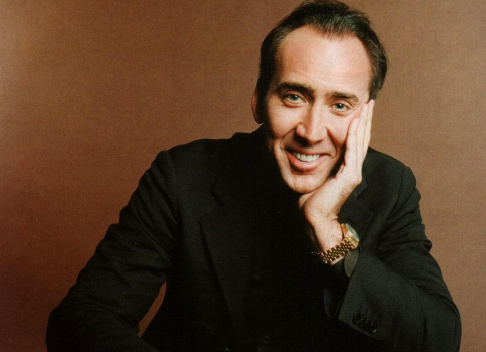

This is my first blog post, this is also a post about how I made my blog and why I made it.

## Topics

1. Why I made this blog
2. Development side of me
3. Fitness Side
4. Podcasting Side

---

# Why did I make this blog?

Like everyone, I yern to expsress myself and exsplore the world around me.
Also like everyone this can often turn into a mess of thoughts, ideas, and dreams that just get muddled up and seldom completed.
This blog is a testomony to that.

This blog was inspired and pushed by a coding challange task set up in the Zero-to-Mastery group.

It's built to bring together many different aspects of my life and all my online presense into one.
From writting, to MMA, to development, and my love for bad movies.

I

